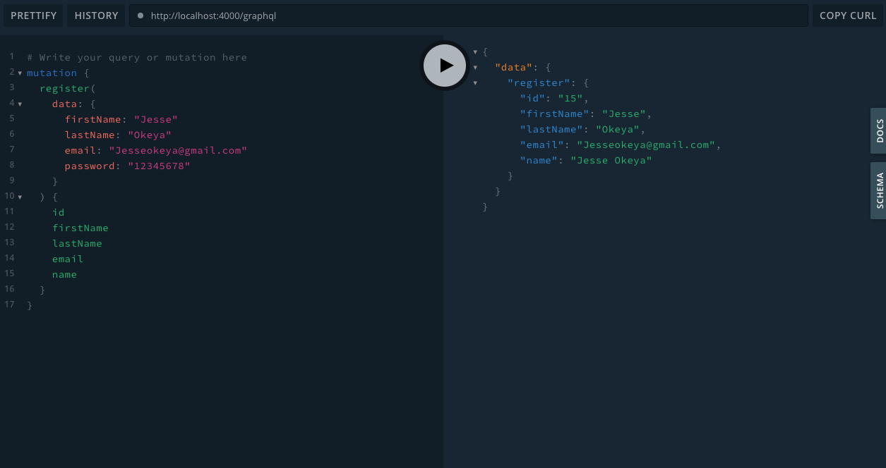
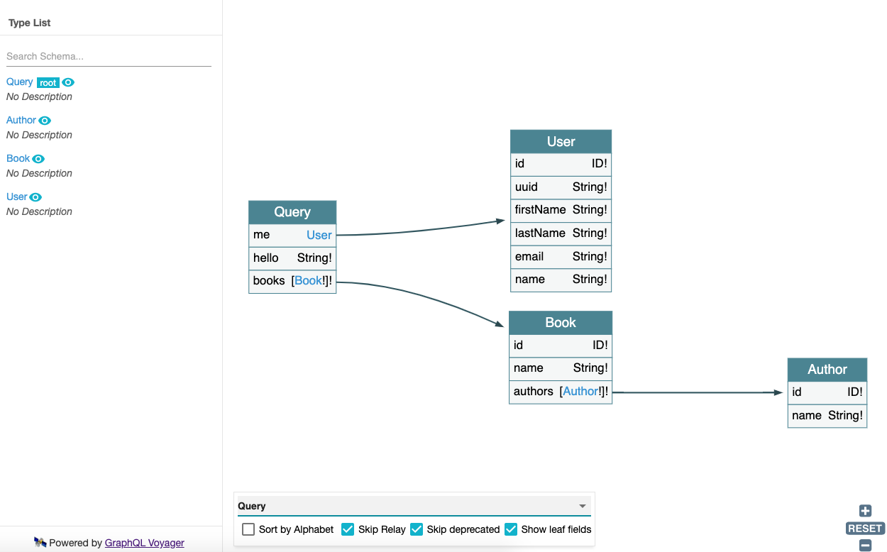
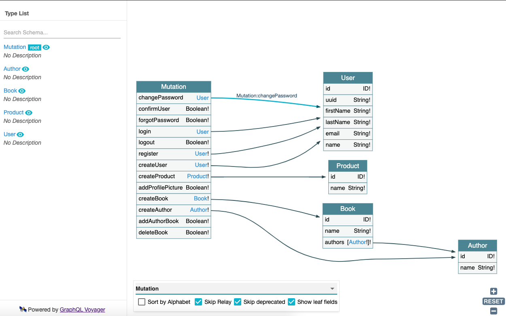
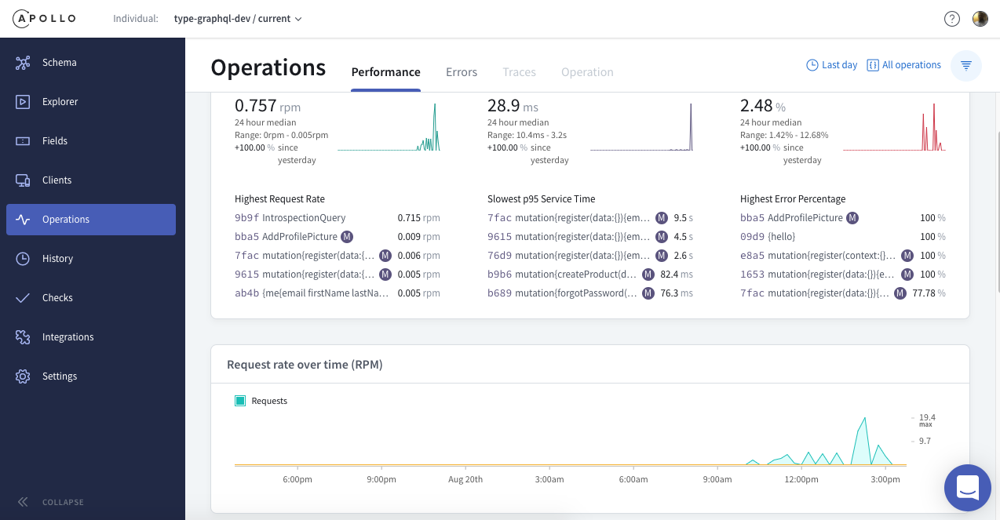
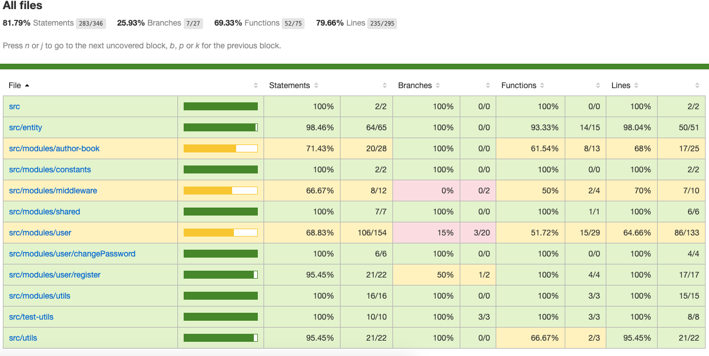
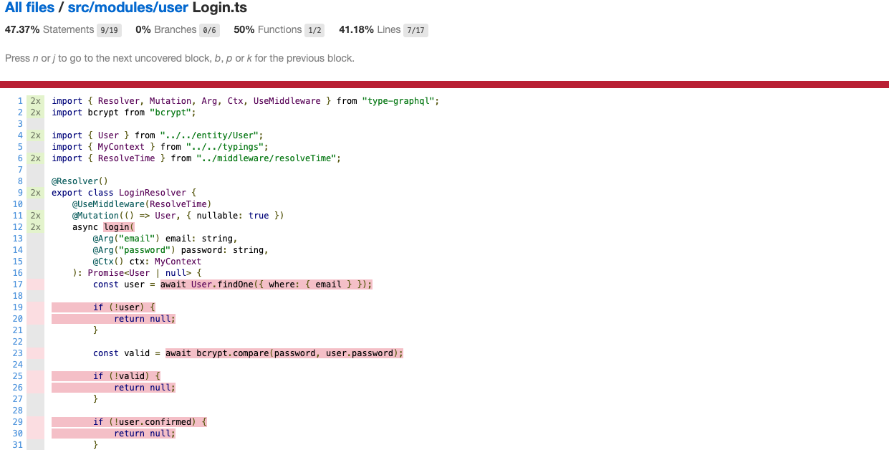

# type-graphql
Playing around with apollo graphql type-graphql typorm postgres and redis

## Requirements
- postgres
- redis
- node

## Features
### Graphql server - /graphql endpoint


### Schema Queries and Mutation visualizations using graphql-voyager - /voyager endpoint




### Monitoring and metrics using apollo (you will need `APOLLO_KEY` environment variable set)


## Environment variables
```
NODE_ENV=development
SESSION_SECRET=superSecureSecret
DB_USER=postgres
DB_PASS=postgres

# Apollo Monitoring api key
APOLLO_KEY= 
```

## Getting Postgres running

### Install postgres on mac using homebrew
```
brew install postgres
```

### Creating a postgres database
```
createdb <databaseName>
```

### Starting and stoping postgres locally
```
brew services start postgres
```

```
brew services stop postgres
```

### Useful postgres interactive shell commands
```
\l - list databases
\dt - list tables
\d table_name - describe table
\dn - list available schema
\df - list available functions
\dv - list available views
\du - list users and their roles
\g - execute previous command
\s - display command history
\? - help
```

## Getting reddis running locally 

#### Install redis locally
```
brew install redis
```

#### Starting up a redis server locally
```
redis-server
```

## Running the server

```
npm install
```

```
npm start
```

## Running test
```
npm test
```

## Running tests with code coverage
```
npm run coverage
```




## Building for production
```
npm run build
```

## Running in production
```
npm run prod
```